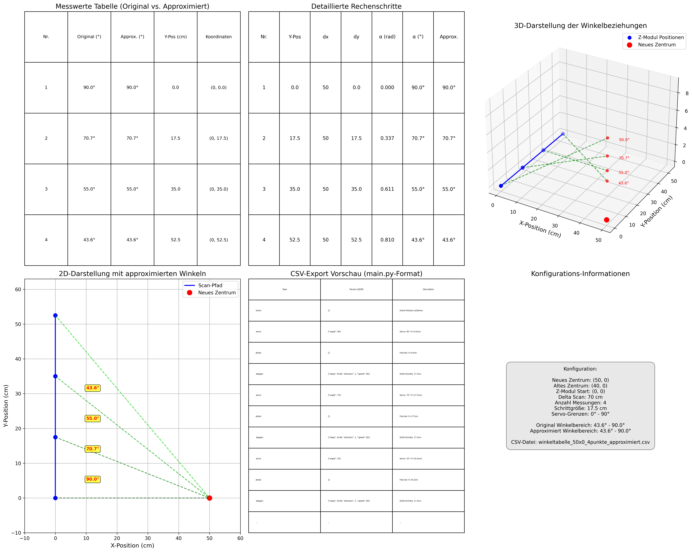

# I-Scan 3D-Scanner - Einfache Anleitung für Studenten

## Was ist I-Scan?

**I-Scan** ist ein selbstgebauter 3D-Scanner, der günstig und einfach zu warten ist. Er kann große Objekte von allen Seiten fotografieren und daraus 3D-Modelle erstellen.

### Wie funktioniert das System?
- **3 bewegliche Kameras** fahren an einer Stange hoch und runter
- Die **Kameras drehen sich** automatisch zu verschiedenen Winkeln  
- Das System macht **viele Fotos** von allen Seiten des Objekts
- Aus diesen Fotos entsteht später ein **3D-Modell** am Computer

## Projektstruktur

Das Projekt ist in mehrere Hauptkomponenten unterteilt:

### Haupt-Verzeichnisse
- `/implementation/ControlScript/` - Python-basierte Steuerungssoftware
- `/implementation/PositionUnit_with_API/` - ESP32-basierte Positionseinheiten
- `/docs/markdown/` - Umfassende Projektdokumentation

### Kern-Dateien im ControlScript
- `main.py` - Hauptanwendung mit GUI
- `api_client.py` - API-Kommunikation
- `device_control.py` - Gerätekontrolle
- `logger.py` - Logging-Funktionalität
- `operation_queue.py` - Verwaltung der Operationen
- `webcam_helper.py` - Kamera-Funktionalität

## System-Architektur

Das I-Scan System basiert auf einer **REST API**-Architektur und umfasst:

```
┌─────────────────────────────────────────────────────────────────┐
│                        I-Scan System                            │
├─────────────────────────────────────────────────────────────────┤
│                                                                 │
│  ┌─────────────────┐    ┌─────────────────┐    ┌──────────────┐ │
│  │   Control GUI   │◄──►│   REST API      │◄──►│  Hardware    │ │
│  │   (main.py)     │    │   Webserver     │    │  Controller  │ │
│  └─────────────────┘    └─────────────────┘    └──────────────┘ │
│           │                       │                     │       │
│           ▼                       ▼                     ▼       │
│  ┌─────────────────┐    ┌─────────────────┐    ┌──────────────┐ │
│  │  Queue Manager  │    │  API Client     │    │ Position     │ │
│  │ (operation_     │    │ (api_client.py) │    │ Units        │ │
│  │  queue.py)      │    │                 │    │ (ESP32)      │ │
│  └─────────────────┘    └─────────────────┘    └──────────────┘ │
│           │                       │                     │       │
│           ▼                       ▼                     ▼       │
│  ┌─────────────────┐    ┌─────────────────┐    ┌──────────────┐ │
│  │  Calculator     │    │  Device Control │    │ Camera       │ │
│  │ (calculator/)   │    │ (device_        │    │ System       │ │
│  │                 │    │  control.py)    │    │              │ │
│  └─────────────────┘    └─────────────────┘    └──────────────┘ │
│                                                                 │
└─────────────────────────────────────────────────────────────────┘
```

### Hardware-Komponenten
1. **Bewegliche Module**: Drei Module, die entlang der Z-Achse bewegt werden können
2. **Kameras**: Jede Einheit ist mit einer konfigurierbaren Kamera ausgestattet
3. **Positionseinheiten**: ESP32-basierte Controller für Bewegungssteuerung
4. **Beleuchtungseinheiten**: Steuerbare LED-Beleuchtung

### Software-Komponenten
- **Webserver**: Zentrale Steuerung via REST API
- **Control Script**: Python-GUI für Benutzerinteraktion
- **Position Units**: Firmware für Bewegungssteuerung
- **Kalkulatoren**: Winkel- und Positionsberechnungen

### Programmablauf-Diagramm

```
┌─────────────┐    ┌─────────────┐    ┌─────────────┐
│   Start     │───►│ Initialize  │───►│ Load Config │
│  main.py    │    │   Logger    │    │    JSON     │
└─────────────┘    └─────────────┘    └─────────────┘
       │                   │                   │
       ▼                   ▼                   ▼
┌─────────────┐    ┌─────────────┐    ┌─────────────┐
│   Create    │───►│  Connect    │───►│    Start    │
│     GUI     │    │ Hardware    │    │   Camera    │
└─────────────┘    └─────────────┘    └─────────────┘
       │                   │                   │
       ▼                   ▼                   ▼
┌─────────────┐    ┌─────────────┐    ┌─────────────┐
│   Queue     │───►│  Execute    │───►│   Capture   │
│ Management  │    │ Operations  │    │   Images    │
└─────────────┘    └─────────────┘    └─────────────┘
       │                   │                   │
       ▼                   ▼                   ▼
┌─────────────┐    ┌─────────────┐    ┌─────────────┐
│  Generate   │───►│   Export    │───►│    Save     │
│    CSV      │    │   Images    │    │   Results   │
└─────────────┘    └─────────────┘    └─────────────┘
```

---

# 1. Ablauf der Programme

## 1.1 Überblick - Was passiert beim Scannen?

### Schritt-für-Schritt Erklärung:

```
Vorbereitungsphase:
1. Calculator erstellt Winkeltabelle → CSV-Datei mit allen Positionen
2. Scanner fährt zur Startposition (Home)
3. Kameras werden aktiviert

Scan-Phase:
4. Scanner bewegt sich zur ersten Position
5. Kamera dreht sich zum ersten Winkel 
6. Foto wird aufgenommen
7. Wiederholung für alle Positionen und Winkel

Nachbearbeitung:
8. Alle Fotos werden gespeichert
9. CSV-Log wird erstellt
10. 3D-Software kann die Bilder zu einem Modell verarbeiten
```

## 1.2 Die drei wichtigsten Programme

### A) Calculator (calculator_simplified.py)
**Was macht es:** Berechnet alle Winkelpositionen für den Scan

```python
# Startet die Berechnung für verschiedene Scan-Auflösungen
python calculator_simplified.py
```

**Ergebnis:** CSV-Dateien mit perfekten Winkeln für den Scanner

### B) Main Control (main.py)  
**Was macht es:** Hauptprogramm mit grafischer Oberfläche

```python
# Startet das Hauptprogramm
py main.py
```

**Funktionen:**
- Kamera-Live-Ansicht
- Manuelle Steuerung der Scanner-Position
- Automatischer Scan mit CSV-Dateien
- Einstellungen für Hardware

### C) API Client (api_client.py)
**Was macht es:** Kommuniziert mit der Scanner-Hardware

**Funktionen:**
- Sendet Bewegungsbefehle an die Motoren
- Empfängt Status-Informationen
- Steuert LED-Beleuchtung

## 1.3 Typischer Arbeitsablauf für Studenten

### Vorbereitung (einmalig):
1. **Python installieren** und Bibliotheken hinzufügen
2. **Scanner-Hardware** anschließen und IP-Adressen konfigurieren  
3. **CSV-Dateien erstellen** mit dem Calculator

### Jeden Scan:
1. **Objekt positionieren** in der Mitte des Scanners
2. **main.py starten** und Kamera aktivieren
3. **CSV-Datei laden** (z.B. für 30 Aufnahmen)
4. **Scan starten** und warten bis fertig
5. **Fotos prüfen** und bei Bedarf wiederholen

---

# 2. Verwendung der Programme

## 2.1 Installation und Setup

### Python-Bibliotheken installieren:
```powershell
py -m pip install pillow opencv-python requests tabulate matplotlib
```

### Erforderliche Bibliotheken:
- `tkinter` (meist mit Python vorinstalliert) - für die grafische Oberfläche
- `PIL` (Pillow) - für Bildbearbeitung
- `OpenCV` - für Kamera-Funktionen
- `requests` - für API-Kommunikation mit dem Scanner
- `tabulate` - für schöne Tabellen im Terminal
- `matplotlib` - für Grafiken und Diagramme

### Programm starten:
```powershell
py main.py
```

## 2.2 Hardware-Konfiguration (config.json)

Bevor ihr scannen könnt, müssen die IP-Adressen der Scanner-Teile eingetragen werden:

```json
{
    "IpPositionUnitTop": "192.168.1.10",     # Oberer Scanner
    "IpPositionUnitMid": "192.168.1.11",     # Mittlerer Scanner  
    "IpPositionUnitBot": "192.168.1.12",     # Unterer Scanner
    "IpLightingUnitA": "192.168.1.20",       # Beleuchtung A
    "IpLightingUnitB": "192.168.1.21",       # Beleuchtung B
    "ComPortMeasurementUnitTop": "COM3",      # USB-Anschluss Oben
    "ComPortMeasurementUnitMid": "COM4",      # USB-Anschluss Mitte
    "ComPortMeasurementUnitBot": "COM5"       # USB-Anschluss Unten
}
```

## 2.3 CSV-Dateien verstehen und verwenden

### Beispiel: winkeltabelle_50x0_30punkte_approximiert.csv

Diese Datei enthält **30 Scan-Positionen** für einen **50cm hohen** Scan-Bereich:

```csv
type,params,description
home,{},Home-Position anfahren
servo,"{""angle"": 90}",Servo: Winkel auf 90° setzen (Y=0.0cm)
photo,{},"Kamera: Foto aufnehmen bei Y=0.0cm, Winkel=90°"
stepper,"{""steps"": 1086, ""direction"": 1, ""speed"": 80}","Stepper: 1086 Schritte, 2.3cm, Richtung aufwärts, Geschwindigkeit: 80"
servo,"{""angle"": 87}",Servo: Winkel auf 87° setzen (Y=2.3cm)
photo,{},"Kamera: Foto aufnehmen bei Y=2.3cm, Winkel=87°"
```

### Was bedeuten die Spalten?

- **type**: Art der Aktion (`home`, `servo`, `stepper`, `photo`)
- **params**: Parameter als JSON (Winkel, Schritte, Geschwindigkeit)  
- **description**: Menschenlesbare Beschreibung was passiert

### Scan-Visualisierung



*Das Bild zeigt:*
- **Blaue Linie**: Berechneter Scan-Pfad
- **Rote Punkte**: Foto-Positionen  
- **Grüne Linie**: Approximierter Pfad
- **Tabellen**: Genaue Winkel und Koordinaten

## 2.4 Praktische Bedienung

### Mit der grafischen Oberfläche (GUI):

1. **Kamera starten**: 
   - Button "Start Camera" klicken
   - Live-Bild vom Scanner erscheint

2. **Scanner manuell bewegen**:
   - Servo-Winkel eingeben (0-180°)
   - Stepper-Schritte eingeben  
   - "Add to Queue" um Bewegung zu planen

3. **Automatischer Scan**:
   - CSV-Datei mit "Import CSV" laden
   - "Execute Queue" um den kompletten Scan zu starten
   - Fotos werden automatisch gespeichert

4. **Beleuchtung einstellen**:
   - LED-Farbe wählen (RGB-Werte)
   - Helligkeit anpassen

### Mit PowerShell-Befehlen:

```powershell
# Scan-Konfiguration ändern
Invoke-RestMethod -Uri "http://192.168.1.10/api/config/scan" -Method PUT -Body '{
    "numPics": 30, 
    "resolution": 0.5, 
    "cameras": ["top", "mid", "bot"], 
    "height": 50
}' -ContentType "application/json"

# Scan starten
Invoke-RestMethod -Uri "http://192.168.1.10/api/scan/start" -Method POST
```

## 2.5 Winkel-Berechnung verstehen

### Das Koordinatensystem:

```
3D-Scanner Koordinatensystem:
                                      
        Z-Achse (Höhe)                
              ▲                       
              │                       
              │     Y-Achse (Tiefe)   
              │    ╱                  
              │   ╱                   
              │  ╱                    
              │ ╱                     
              │╱                      
              └─────────────► X-Achse (Breite)
```

### Einfache Trigonometrie:

```
Warum verschiedene Winkel?

       Kamera              Objekt
         │                   │
         │ ◄── distance ──► │
         │                   │
    ┌────▼────┐         ┌────▼────┐
    │         │ ◄─ α ──►│         │
    │  Servo  │         │ Target  │
    │ Position│         │  Point  │
    └─────────┘         └─────────┘

Je höher die Kamera → Je steiler der Winkel
α = arctan(distance / height)

Beispiel: 
- Höhe = 50cm, Distanz = 25cm
- α = arctan(25/50) = 26.6°
```

---

# 3. API-Dokumentation

## 3.1 Grundlagen der REST API

Die Scanner-Hardware wird über **HTTP-Anfragen** gesteuert. Denkt daran wie an eine Website, die statt Webseiten Aktionen ausführt.

### Basis-URL: `http://[Scanner-IP]/api/`

## 3.2 GET-Requests (Informationen abrufen)

### Konfiguration lesen:
```powershell
# Aktuelle Einstellungen des Scanners
Invoke-RestMethod -Uri "http://192.168.1.10/api/config/general" -Method GET
```

**Antwort Beispiel:**
```json
{
    "scanHeight": 50,
    "numPoints": 30,
    "currentPosition": "home",
    "cameraActive": true
}
```

### Scan-Status prüfen:
```powershell  
# Ist der Scanner gerade beschäftigt?
Invoke-RestMethod -Uri "http://192.168.1.10/api/scan/status" -Method GET
```

**Antwort Beispiel:**
```json
{
    "status": "scanning",
    "progress": 45,
    "currentStep": "photo",
    "remainingTime": "00:15:30"
}
```

### Einzelnes Foto anfordern:
```powershell
# Foto mit bestimmten Parametern
Invoke-RestMethod -Uri "http://192.168.1.10/api/picture?cam=1&height=20&angle=45" -Method GET
```

## 3.3 POST/PUT-Requests (Einstellungen ändern)

### Beleuchtung konfigurieren:
```powershell
# LED-Farbe auf Rot setzen
Invoke-RestMethod -Uri "http://192.168.1.10/api/config/lighting" -Method PUT -Body '{
    "lightingUnit": "A", 
    "colorHex": "FF0000FF",
    "brightness": 80
}' -ContentType "application/json"
```

### Servo-Position setzen:
```powershell
# Kamera auf 45° drehen
Invoke-RestMethod -Uri "http://192.168.1.10/api/servo/position" -Method PUT -Body '{
    "angle": 45,
    "speed": 50
}' -ContentType "application/json"
```

### Stepper-Motor bewegen:
```powershell
# 1000 Schritte nach oben
Invoke-RestMethod -Uri "http://192.168.1.10/api/stepper/move" -Method PUT -Body '{
    "steps": 1000,
    "direction": 1,
    "speed": 80
}' -ContentType "application/json"
```

## 3.4 DELETE-Requests (Zurücksetzen)

### Konfiguration löschen:
```powershell
# Alle Einstellungen auf Standard zurücksetzen
Invoke-RestMethod -Uri "http://192.168.1.10/api/config/general" -Method DELETE
```

### Scan abbrechen:
```powershell
# Laufenden Scan stoppen
Invoke-RestMethod -Uri "http://192.168.1.10/api/scan/abort" -Method DELETE
```

## 3.5 Typische API-Workflows

### Vollständiger Scan-Ablauf:

```powershell
# 1. Scanner zur Home-Position
Invoke-RestMethod -Uri "http://192.168.1.10/api/position/home" -Method POST

# 2. Beleuchtung einschalten  
Invoke-RestMethod -Uri "http://192.168.1.10/api/config/lighting" -Method PUT -Body '{
    "lightingUnit": "A", 
    "colorHex": "FFFFFFFF",
    "brightness": 100
}' -ContentType "application/json"

# 3. Scan-Parameter setzen
Invoke-RestMethod -Uri "http://192.168.1.10/api/config/scan" -Method PUT -Body '{
    "numPics": 30, 
    "height": 50,
    "cameras": ["top", "mid", "bot"]
}' -ContentType "application/json"

# 4. Scan starten
Invoke-RestMethod -Uri "http://192.168.1.10/api/scan/start" -Method POST

# 5. Status überwachen (wiederholen bis fertig)
do {
    $status = Invoke-RestMethod -Uri "http://192.168.1.10/api/scan/status" -Method GET
    Write-Host "Progress: $($status.progress)%"
    Start-Sleep -Seconds 5
} while ($status.status -eq "scanning")
```

## 3.6 Fehlerbehandlung

### Häufige HTTP-Status-Codes:
- **200 OK**: Alles funktioniert
- **400 Bad Request**: Falsche Parameter  
- **404 Not Found**: Endpunkt existiert nicht
- **500 Internal Server Error**: Hardware-Problem

### Debugging-Tipps:

```powershell
# Scanner erreichbar?
ping 192.168.1.10

# Port offen?
Test-NetConnection -ComputerName 192.168.1.10 -Port 80

# Detaillierte Fehler anzeigen
try {
    Invoke-RestMethod -Uri "http://192.168.1.10/api/scan/start" -Method POST
} catch {
    Write-Host "Fehler: $($_.Exception.Message)"
}
```

---

# Zusammenfassung für Studenten

## Die drei wichtigsten Schritte:

1. **CSV-Datei erstellen** mit `calculator_simplified.py`
2. **Scanner steuern** mit `main.py` 
3. **API verwenden** für erweiterte Funktionen

## Wichtige Dateien merken:
- `winkeltabelle_50x0_30punkte_approximiert.csv` → 30 Fotos, 50cm Höhe
- `scan_visualization_approximated.png` → Zeigt den berechneten Pfad
- `config.json` → IP-Adressen der Hardware

Das I-Scan System ist perfekt für Studenten-Projekte, weil es alle Berechnungen automatisch macht und ihr euch auf das Experimentieren konzentrieren könnt!